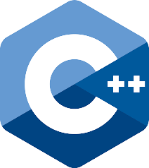
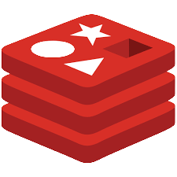
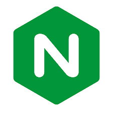

<h1 align="center">Olá! Meu nome é Paulo Uilian 👨‍💻☕</h1> 

<h3 align="start">Tenho 23 anos, moro em Jequié/BA e sou fascinado pelo desenvolvimento de lógica de programação.</h3>

- 🚀 Desenvolvedor web full-stack pela [Driven Education](https://www.driven.com.br/).
- 🎓 Graduando em Sistemas de Informação pela [UESB](https://www.uesb.br/).
- 📖 Atualmente estou estudando Golang.
- 🧙‍♂️ Aperfeiçoando meus conhecimentos em Node.js e Paterns.

***

 
  
 

***

🛠 Tecnologias e Ferramentas

### _Linguagens_

    

### _Front-end_

<a href="https://reactjs.org/" target="_blank">  <a href="https://sass-lang.com/" target="_blank">  
     

### _Back-end_

    

### _Banco de Dados_
    

### _Ferramentas_

    

#

<h3 align="left">Conecte-se comigo:</h3>

 ### Here is a random joke that'll make you laugh!
 
